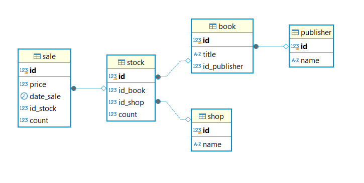

# Домашняя работа к лекции «Python и БД. ORM»

## Задание 1

Составлена модель классов SQLAlchemy по схеме:



Легенда: система хранит информацию об издателях (авторах), их книгах и фактах продажи. Книги могут продаваться в разных магазинах, поэтому требуется учитывать не только что за книга была продана, но и в каком магазине это было сделано, а также когда.

Интуитивно выбраны подходящие типы и связи полей.

## Задание 2

Используя SQLAlchemy, составлен запрос выборки магазинов, продающих целевого издателя.

Написан Python-скрипт, который:

- подключается к БД типа PostgreSQL;
- импортирует необходимые модели данных;
- принимает имя или идентификатор издателя (publisher) через `input()`. Выводит построчно факты покупки книг этого издателя:

```
название книги | название магазина, в котором была куплена эта книга | стоимость покупки | дата покупки
```

Пример (был введен идентивикатор издателя — `1`):

```
Programming Python, 4th Edition         | Labirint | 50.05 | 2018-10-25
Natural Language Processing with Python | Labirint | 50.05 | 2018-10-25
Programming Python, 4th Edition         | Amazon   | 16.0  | 2018-10-25
```

## Задание 3 (необязательное)

Заполнена БД тестовыми данными.

Тестовые данные берутся из файла tests_data.json
